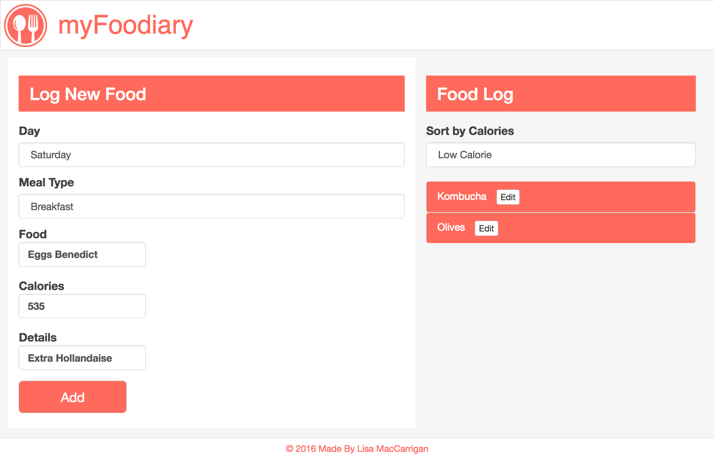

# **meal-tracker**

#### A meal tracker built using Angular2. 10.21.2016

#### By [Lisa MacCarrigan](https://github.com/lisamaccarrigan)
#

----
### **Description**

This is a web application that allows a user to log foods they have eaten each day, including details about the meal and the number of calories per item. Added foods can also be filtered based upon calorie content. This application utilizes Angular2.

----
### **Specifications**
| _Behavior_ | _Input_ | _Output_ |
|:---------------------------------------------------------------------:|:---------------------------------------------------------------------------:|:-------------------------------------------------------------------------------------------------------------------:|
| Select Day From Dropdown Menu | Select "Monday" | "Monday" |
| Select Meal Type From Dropdown Menu | Select "Breakfast" | "Breakfast" |
| Enter Food Name | "Banana" | "Banana" |
| Enter Calories | 105 | 105 |
| Add Details | "Organic" | "Organic" |
| Edit Food | Change Meal Type to "Snack" | "Snack" |
| Filter Foods by Calories ("High" or "Low") | Select "Low Calorie" | lists all foods < 500 cal |

----
### **Setup/Installation Requirements**

* Clone this repository: https://github.com/LisaMacCarrigan/meal-tracker-angular2.git
* Open project folder ('meal-tracker-angular2') in Code Editor of choice
* In terminal, run:

        $ npm install
        $ bower install
        $ gulp build
        $ gulp serve

----

### **Known Bugs**

No known bugs.

----
### **Support and contact details**

For comments or questions, please email Lisa.MacCarrigan@gmail.com

----
### **Technologies Used**

* Angular2
* HTML
* JavaScript
* TypeScript
* jQuery
* Gulp
* Bootstrap CDN
* npm JS package manager
* Bower package manager

----
### **License**

*This application is licensed under the MIT license*

----
----
**Copyright (c) 2016 [Lisa MacCarrigan](https://github.com/lisamaccarrigan)**
